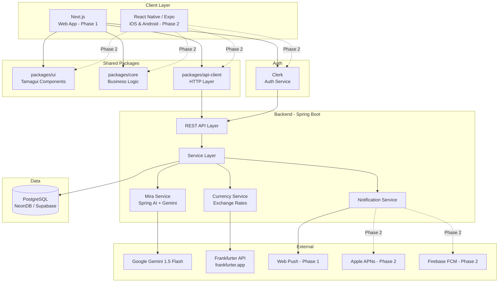
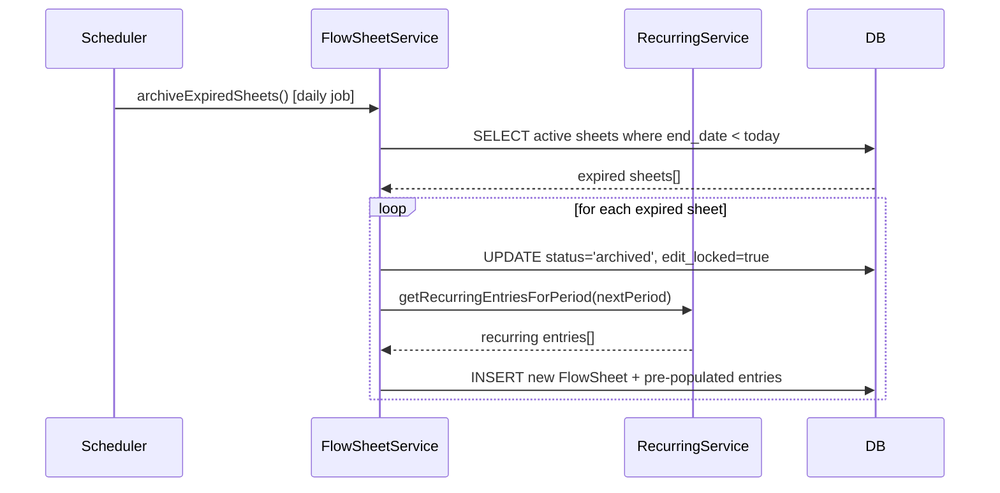
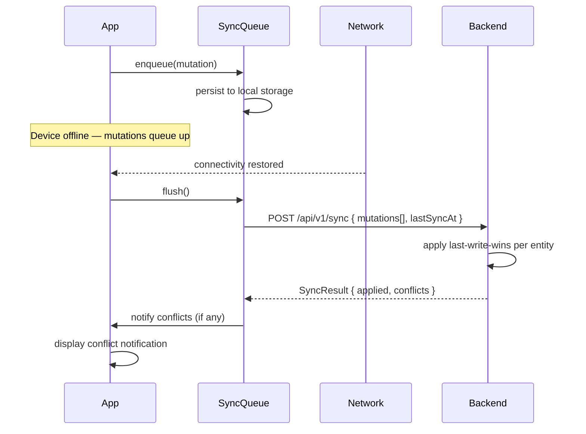
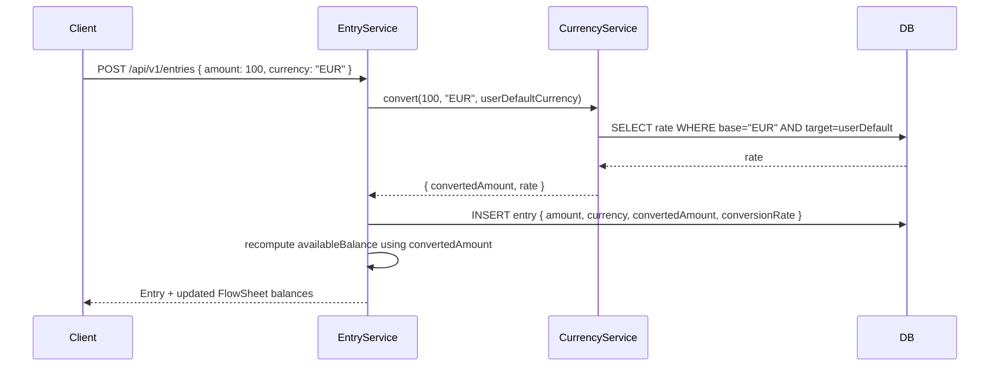
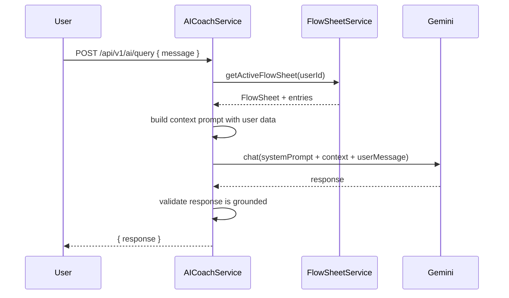

# Design Document: Lunero Budgeting App

## Overview

Lunero is a calm, nature-inspired personal budgeting app targeting individuals who want effortless manual budget tracking. **Phase 1 targets Web only (Next.js).** Phase 2 will extend to iOS and Android via React Native (Expo). The central budgeting unit is a **FlowSheet** — a period-based budget container (weekly, monthly, or custom) that auto-archives at period end and resets fresh.

**Core formula:** `Available Balance = Total Income − (Total Expenses + Total Savings)`

The Phase 1 system is a monorepo with a Next.js web app, shared Tamagui UI components, shared core business logic, and a Spring Boot backend. All auth flows through Clerk; all currency conversion happens server-side. The architecture is designed so that Phase 2 mobile support can be added without restructuring the backend or shared packages.

---

## Architecture

### High-Level System Diagram



### Monorepo Structure

```
lunero/
├── apps/
│   ├── web/                     # Next.js 14 App Router (Phase 1)
│   │   ├── app/                 # Next.js routes
│   │   └── components/          # Web-specific components
│   └── mobile/                  # Expo React Native — Phase 2
├── packages/
│   ├── ui/                      # Tamagui shared component library
│   ├── core/                    # Business logic: balance calc, period logic, recurring
│   └── api-client/              # Axios/fetch wrapper
├── backend/
│   └── src/main/java/com/lunero/
│       ├── flowsheet/           # FlowSheet domain
│       ├── entry/               # Entry domain
│       ├── category/            # Category domain
│       ├── currency/            # Currency conversion service
│       ├── ai/                  # Mira service
│       ├── notification/        # Push notification dispatch
│       ├── user/                # User profile management
│       └── security/            # JWT validation, RBAC, audit log
└── .kiro/
```

### Key Architectural Decisions

| Decision | Choice | Rationale |
|---|---|---|
| Monorepo | Turborepo | Shared `core` and `ui` packages, unified CI; ready for Phase 2 mobile |
| Phase 1 platform | Web only (Next.js) | Faster to ship, no App Store friction, easy to iterate |
| State management | Zustand (client) | Lightweight, works in both Next.js and React Native (Phase 2) |
| API auth | Clerk JWT → Spring Boot filter | No custom auth logic; Clerk issues tokens |
| Currency conversion | Backend only (Spring Boot) | Single source of truth; never client-side |
| FX rate caching | In-memory (Caffeine, 24h TTL) | No DB table needed; Frankfurter is free but external — cache avoids per-request calls and provides resilience |
| AI context | User's FlowSheet data injected as context | Grounded responses, no hallucination |
| Offline queue | Phase 2 only | Web users are always online; mobile will add WatermelonDB/MMKV queue |
| Conflict resolution | Last-write-wins with timestamp | Simple, predictable; implemented in Phase 2 with mobile sync |

---

## Components and Interfaces

### Frontend — Shared Packages

#### `packages/core`

```typescript
// FlowSheet balance calculation (shared, pure function)
export function computeAvailableBalance(entries: Entry[]): number

// Period utilities
export function isWithinPeriod(date: Date, sheet: FlowSheet): boolean
export function getNextPeriodRange(sheet: FlowSheet): { start: Date; end: Date }
export function shouldAutoArchive(sheet: FlowSheet, now: Date): boolean

// Recurring entry logic
export function getRecurringEntriesForPeriod(
  recurring: RecurringEntry[],
  period: { start: Date; end: Date }
): Entry[]

// Validation
export function validateEntry(entry: Partial<Entry>): ValidationResult
export function validateFlowSheet(sheet: Partial<FlowSheet>): ValidationResult
```

#### `packages/ui` (Tamagui)

Key shared components:

- `FlowSheetCard` — summary card showing period, available balance, income/expense/savings totals
- `EntryRow` — single entry display with amount, category chip, date, note
- `EntryForm` — modal/sheet for creating/editing entries (amount, type, category, date, currency, note)
- `CalendarGrid` — date grid with colored day indicators
- `TrendChart` — bar/line chart for weekly/monthly/yearly trends
- `CategoryChip` — colored pill with category name
- `BalanceDisplay` — large available balance figure with income/expense/savings breakdown
- `AICoachPanel` — chat-style interface for AI queries and alerts
- `OnboardingStep` — step wrapper for onboarding flow

#### `packages/api-client`

```typescript
// FlowSheet endpoints
export const flowSheetApi = {
  getActive(): Promise<FlowSheet>
  getAll(): Promise<FlowSheet[]>
  getById(id: string): Promise<FlowSheet>
  create(data: CreateFlowSheetDto): Promise<FlowSheet>
  update(id: string, data: UpdateFlowSheetDto): Promise<FlowSheet>
  unlock(id: string): Promise<FlowSheet>
}

// Entry endpoints
export const entryApi = {
  list(flowSheetId: string): Promise<Entry[]>
  create(data: CreateEntryDto): Promise<Entry>
  update(id: string, data: UpdateEntryDto): Promise<Entry>
  delete(id: string): Promise<void>
}

// Sync queue (offline-first — Phase 2 mobile only)
export const syncQueue = {
  enqueue(mutation: QueuedMutation): void
  flush(): Promise<SyncResult>
  getPending(): QueuedMutation[]
}
```

### Backend — Spring Boot Services

#### FlowSheetService
- `createFlowSheet(userId, dto)` — validates no overlapping ranges, persists
- `archiveExpiredSheets()` — scheduled job, runs daily; archives and creates next period
- `getActiveFlowSheet(userId)` — returns current active sheet with computed `availableBalance`
- `unlockPastSheet(userId, sheetId)` — sets `editLocked = false`, re-locks on save

#### EntryService
- `createEntry(userId, dto)` — validates amount > 0, triggers currency conversion if needed, recalculates balance
- `updateEntry(userId, entryId, dto)` — validates ownership, recalculates balance
- `deleteEntry(userId, entryId)` — soft-delete, recalculates balance

#### CurrencyService
- `convert(amount, fromCurrency, toCurrency)` — uses in-memory cached exchange rates (Caffeine, 24h TTL)
- `refreshRates()` — scheduled every 24h, fetches from Frankfurter API (`api.frankfurter.app/latest`); updates in-memory cache
- `getRates()` — returns current cached rates with timestamp

#### AICoachService
- `query(userId, userMessage)` — builds context from user's FlowSheet data, calls Gemini via Spring AI, returns grounded response
- `checkProactiveAlerts(userId)` — evaluates balance projection and missing recurring entries, returns alerts
- `dismissAlert(userId, alertId)` — marks alert dismissed for current period

#### SyncService *(Phase 2 — mobile only)*
- `applyMutations(userId, mutations[])` — processes queued mutations in order, applies last-write-wins on conflict
- `getConflicts(userId)` — returns unresolved conflicts for user notification

#### NotificationService
- `sendOverspendAlert(userId)` — dispatches via Web Push (Phase 1); APNs / FCM added in Phase 2
- `logFailure(userId, platform, error)` — records delivery failure, retries once

---

## Data Models

### PostgreSQL Schema

```sql
-- Users (profile data; identity managed by Clerk)
CREATE TABLE users (
    id                  UUID PRIMARY KEY DEFAULT gen_random_uuid(),
    clerk_user_id       VARCHAR(255) UNIQUE NOT NULL,
    display_name        VARCHAR(255) NOT NULL,
    default_currency    VARCHAR(10) NOT NULL DEFAULT 'USD',
    flowsheet_period    VARCHAR(20) NOT NULL DEFAULT 'monthly', -- weekly | monthly | custom
    theme_preference    VARCHAR(20) NOT NULL DEFAULT 'system',  -- light | dark | system
    overspend_alerts    BOOLEAN NOT NULL DEFAULT TRUE,
    onboarding_complete BOOLEAN NOT NULL DEFAULT FALSE,
    onboarding_step     INTEGER NOT NULL DEFAULT 0,
    tutorial_complete   BOOLEAN NOT NULL DEFAULT FALSE,
    created_at          TIMESTAMPTZ NOT NULL DEFAULT NOW(),
    updated_at          TIMESTAMPTZ NOT NULL DEFAULT NOW()
);

-- FlowSheets
CREATE TABLE flow_sheets (
    id              UUID PRIMARY KEY DEFAULT gen_random_uuid(),
    user_id         UUID NOT NULL REFERENCES users(id) ON DELETE CASCADE,
    period_type     VARCHAR(20) NOT NULL,  -- weekly | monthly | custom
    start_date      DATE NOT NULL,
    end_date        DATE NOT NULL,
    status          VARCHAR(20) NOT NULL DEFAULT 'active', -- active | archived
    edit_locked     BOOLEAN NOT NULL DEFAULT TRUE,
    created_at      TIMESTAMPTZ NOT NULL DEFAULT NOW(),
    updated_at      TIMESTAMPTZ NOT NULL DEFAULT NOW(),
    CONSTRAINT no_overlap EXCLUDE USING gist (
        user_id WITH =,
        daterange(start_date, end_date, '[]') WITH &&
    ) WHERE (status = 'active')
);

-- Categories
CREATE TABLE categories (
    id           UUID PRIMARY KEY DEFAULT gen_random_uuid(),
    user_id      UUID NOT NULL REFERENCES users(id) ON DELETE CASCADE,
    name         VARCHAR(100) NOT NULL,
    entry_type   VARCHAR(20) NOT NULL,  -- income | expense | savings
    is_default   BOOLEAN NOT NULL DEFAULT FALSE,
    sort_order   INTEGER NOT NULL DEFAULT 0,
    created_at   TIMESTAMPTZ NOT NULL DEFAULT NOW(),
    CONSTRAINT category_type_immutable CHECK (entry_type IN ('income', 'expense', 'savings'))
);

-- Entries
CREATE TABLE entries (
    id                  UUID PRIMARY KEY DEFAULT gen_random_uuid(),
    flow_sheet_id       UUID NOT NULL REFERENCES flow_sheets(id) ON DELETE CASCADE,
    user_id             UUID NOT NULL REFERENCES users(id) ON DELETE CASCADE,
    entry_type          VARCHAR(20) NOT NULL,  -- income | expense | savings
    category_id         UUID NOT NULL REFERENCES categories(id),
    amount              NUMERIC(18, 4) NOT NULL,
    currency            VARCHAR(10) NOT NULL,
    converted_amount    NUMERIC(18, 4),        -- in user's default currency
    conversion_rate     NUMERIC(18, 8),
    entry_date          DATE NOT NULL,
    note                TEXT,
    is_deleted          BOOLEAN NOT NULL DEFAULT FALSE,
    client_updated_at   TIMESTAMPTZ,           -- for last-write-wins sync
    created_at          TIMESTAMPTZ NOT NULL DEFAULT NOW(),
    updated_at          TIMESTAMPTZ NOT NULL DEFAULT NOW(),
    CONSTRAINT positive_amount CHECK (amount > 0)
);

-- Recurring Entries
CREATE TABLE recurring_entries (
    id              UUID PRIMARY KEY DEFAULT gen_random_uuid(),
    user_id         UUID NOT NULL REFERENCES users(id) ON DELETE CASCADE,
    entry_type      VARCHAR(20) NOT NULL,
    category_id     UUID NOT NULL REFERENCES categories(id),
    amount          NUMERIC(18, 4) NOT NULL,
    currency        VARCHAR(10) NOT NULL,
    cadence         VARCHAR(20) NOT NULL,  -- daily | weekly | bi-weekly | monthly
    note            TEXT,
    is_paused       BOOLEAN NOT NULL DEFAULT FALSE,
    is_deleted      BOOLEAN NOT NULL DEFAULT FALSE,
    created_at      TIMESTAMPTZ NOT NULL DEFAULT NOW(),
    updated_at      TIMESTAMPTZ NOT NULL DEFAULT NOW()
);

-- Exchange rates are NOT stored in the database.
-- Rates are fetched from Frankfurter API and cached in-memory (Caffeine, 24h TTL).
-- The conversion rate used for each entry is stored on the entry row itself for audit purposes.

-- Category Budget Projections
CREATE TABLE category_projections (
    id              UUID PRIMARY KEY DEFAULT gen_random_uuid(),
    flow_sheet_id   UUID NOT NULL REFERENCES flow_sheets(id) ON DELETE CASCADE,
    user_id         UUID NOT NULL REFERENCES users(id) ON DELETE CASCADE,
    category_id     UUID NOT NULL REFERENCES categories(id) ON DELETE CASCADE,
    projected_amount NUMERIC(18, 4) NOT NULL,
    currency        VARCHAR(10) NOT NULL,
    created_at      TIMESTAMPTZ NOT NULL DEFAULT NOW(),
    updated_at      TIMESTAMPTZ NOT NULL DEFAULT NOW(),
    UNIQUE (flow_sheet_id, category_id),
    CONSTRAINT positive_projected_amount CHECK (projected_amount > 0)
);

-- Mira Dismissed Alerts
CREATE TABLE dismissed_alerts (
    id              UUID PRIMARY KEY DEFAULT gen_random_uuid(),
    user_id         UUID NOT NULL REFERENCES users(id) ON DELETE CASCADE,
    alert_type      VARCHAR(50) NOT NULL,
    flow_sheet_id   UUID REFERENCES flow_sheets(id),
    dismissed_at    TIMESTAMPTZ NOT NULL DEFAULT NOW(),
    UNIQUE (user_id, alert_type, flow_sheet_id)
);

-- Audit Log
CREATE TABLE audit_log (
    id              UUID PRIMARY KEY DEFAULT gen_random_uuid(),
    user_id         UUID NOT NULL,
    entity_type     VARCHAR(50) NOT NULL,
    entity_id       UUID NOT NULL,
    action          VARCHAR(20) NOT NULL,  -- create | update | delete
    payload         JSONB,
    created_at      TIMESTAMPTZ NOT NULL DEFAULT NOW()
);

-- Notification Tokens
CREATE TABLE notification_tokens (
    id          UUID PRIMARY KEY DEFAULT gen_random_uuid(),
    user_id     UUID NOT NULL REFERENCES users(id) ON DELETE CASCADE,
    platform    VARCHAR(20) NOT NULL,  -- ios | android | web
    token       TEXT NOT NULL,
    created_at  TIMESTAMPTZ NOT NULL DEFAULT NOW(),
    UNIQUE (user_id, platform, token)
);
```

### TypeScript Domain Types (packages/core)

```typescript
export type EntryType = 'income' | 'expense' | 'savings';
export type PeriodType = 'weekly' | 'monthly' | 'custom';
export type Cadence = 'daily' | 'weekly' | 'bi-weekly' | 'monthly';
export type ThemePreference = 'light' | 'dark' | 'system';

export interface FlowSheet {
  id: string;
  userId: string;
  periodType: PeriodType;
  startDate: string;       // ISO date string (UTC)
  endDate: string;
  status: 'active' | 'archived';
  editLocked: boolean;
  availableBalance: number; // computed, not stored
  totalIncome: number;      // computed
  totalExpenses: number;    // computed
  totalSavings: number;     // computed
  createdAt: string;
  updatedAt: string;
}

export interface Entry {
  id: string;
  flowSheetId: string;
  userId: string;
  entryType: EntryType;
  categoryId: string;
  amount: number;
  currency: string;
  convertedAmount?: number;
  conversionRate?: number;
  entryDate: string;
  note?: string;
  isDeleted: boolean;
  clientUpdatedAt?: string;
  createdAt: string;
  updatedAt: string;
}

export interface Category {
  id: string;
  userId: string;
  name: string;
  entryType: EntryType;
  isDefault: boolean;
  sortOrder: number;
  createdAt: string;
}

export interface RecurringEntry {
  id: string;
  userId: string;
  entryType: EntryType;
  categoryId: string;
  amount: number;
  currency: string;
  cadence: Cadence;
  note?: string;
  isPaused: boolean;
  isDeleted: boolean;
}

export interface UserProfile {
  id: string;
  clerkUserId: string;
  displayName: string;
  defaultCurrency: string;
  flowsheetPeriod: PeriodType;
  themePreference: ThemePreference;
  overspendAlerts: boolean;
  onboardingComplete: boolean;
  onboardingStep: number;
  tutorialComplete: boolean;
}

export interface CategoryProjection {
  id: string;
  flowSheetId: string;
  userId: string;
  categoryId: string;
  projectedAmount: number;
  currency: string;
  createdAt: string;
  updatedAt: string;
}

export interface ProjectionSummary {
  flowSheetId: string;
  byCategory: Array<{
    categoryId: string;
    categoryName: string;
    entryType: EntryType;
    projectedAmount: number;
    actualAmount: number;
    statusColor: string; // category natural color | warm neutral | #C86D5A (over)
  }>;
  byEntryType: Record<EntryType, { projected: number; actual: number; statusColor: string }>;
  overall: { projected: number; actual: number; statusColor: string };
}
```

---

## API Design

### Authentication

All API requests include a Clerk-issued JWT in the `Authorization: Bearer <token>` header. The Spring Boot security filter validates the JWT against Clerk's JWKS endpoint and extracts `userId` for all downstream operations.

### REST Endpoints

#### FlowSheets

```
GET    /api/v1/flowsheets/active          → FlowSheet (with computed balances)
GET    /api/v1/flowsheets                 → FlowSheet[] (paginated, most recent first)
GET    /api/v1/flowsheets/:id             → FlowSheet
POST   /api/v1/flowsheets                 → FlowSheet
PATCH  /api/v1/flowsheets/:id             → FlowSheet
POST   /api/v1/flowsheets/:id/unlock      → FlowSheet
```

#### Entries

```
GET    /api/v1/flowsheets/:id/entries     → Entry[]
POST   /api/v1/entries                    → Entry
PATCH  /api/v1/entries/:id               → Entry
DELETE /api/v1/entries/:id               → 204
```

#### Categories

```
GET    /api/v1/categories                 → Category[]
POST   /api/v1/categories                 → Category
PATCH  /api/v1/categories/:id            → Category (name, sortOrder only)
DELETE /api/v1/categories/:id            → 204 or 409 (entries exist)
PATCH  /api/v1/categories/:id/reassign   → 204 (reassign entries before delete)
```

#### Recurring Entries

```
GET    /api/v1/recurring                  → RecurringEntry[]
POST   /api/v1/recurring                  → RecurringEntry
PATCH  /api/v1/recurring/:id             → RecurringEntry
DELETE /api/v1/recurring/:id             → 204
POST   /api/v1/recurring/:id/pause       → RecurringEntry
POST   /api/v1/recurring/:id/resume      → RecurringEntry
```

#### Trends

```
GET    /api/v1/trends?view=weekly&from=&to=    → TrendData
GET    /api/v1/trends?view=monthly&from=&to=   → TrendData
GET    /api/v1/trends?view=yearly              → TrendData
GET    /api/v1/trends/:dataPointId/breakdown   → Entry[]
```

#### Mira

```
POST   /api/v1/ai/query                   → { response: string }
GET    /api/v1/ai/alerts                  → Alert[]
POST   /api/v1/ai/alerts/:id/dismiss      → 204
```

#### Sync

```
POST   /api/v1/sync                       → SyncResult
  Body: { mutations: QueuedMutation[], deviceId: string, lastSyncAt: string }
```

#### User Profile

```
GET    /api/v1/profile                    → UserProfile
PATCH  /api/v1/profile                    → UserProfile
DELETE /api/v1/profile                    → 204 (schedules data deletion)
```

#### Currencies

```
GET    /api/v1/currencies                 → { currencies: string[], rates: Record<string, number>, updatedAt: string }
```

#### Budget Projections

```
GET    /api/v1/flowsheets/:id/projections           → CategoryProjection[]
PUT    /api/v1/flowsheets/:id/projections/:categoryId → CategoryProjection
DELETE /api/v1/flowsheets/:id/projections/:categoryId → 204
GET    /api/v1/flowsheets/:id/projections/summary    → ProjectionSummary
```

### Key Request/Response Shapes

```typescript
// POST /api/v1/entries
interface CreateEntryDto {
  flowSheetId: string;
  entryType: EntryType;
  categoryId: string;
  amount: number;
  currency: string;
  entryDate: string;       // DD/MM/YYYY
  note?: string;
  clientUpdatedAt: string; // ISO timestamp for sync
}

// POST /api/v1/sync
interface QueuedMutation {
  id: string;              // client-generated UUID
  operation: 'create' | 'update' | 'delete';
  entityType: 'entry' | 'flowsheet' | 'category' | 'recurring';
  entityId: string;
  payload: Record<string, unknown>;
  clientUpdatedAt: string;
}

interface SyncResult {
  applied: string[];       // mutation IDs applied
  conflicts: ConflictRecord[];
  serverTime: string;
}

// GET /api/v1/trends
interface TrendData {
  view: 'weekly' | 'monthly' | 'yearly';
  periods: TrendPeriod[];
}

interface TrendPeriod {
  id: string;
  label: string;
  startDate: string;
  endDate: string;
  totalIncome: number;
  totalExpenses: number;
  totalSavings: number;
  availableBalance: number;
}
```

---

## Key Flows

### FlowSheet Auto-Archive Flow



### Offline Sync Flow



### Currency Conversion Flow



### Mira Query Flow



---

## Error Handling

### HTTP Error Codes

| Code | Scenario |
|---|---|
| 400 | Validation failure (e.g., amount ≤ 0, missing required field, overlapping FlowSheet dates) |
| 401 | Missing or invalid Clerk JWT |
| 403 | Authenticated user attempting to access another user's data |
| 404 | Entity not found or not owned by user |
| 409 | Conflict — e.g., deleting a category with assigned entries |
| 422 | Business rule violation — e.g., editing a locked Past FlowSheet without unlocking |
| 503 | External dependency unavailable (FX rates, Gemini) |

### Client-Side Error Handling

- Validation errors from `packages/core` are surfaced inline on forms before any API call
- Network errors during online operations show a toast with retry option
- Offline mutations are silently queued; the `SyncStatusBar` indicates pending state
- Currency conversion unavailability: display original amount with a warning badge; exclude from balance
- Mira unavailability: show "Coach is unavailable right now" inline message; do not block other app functions

### Backend Error Handling

- All controllers return `ProblemDetail` (RFC 7807) for structured error responses
- `@ControllerAdvice` handles validation exceptions, auth exceptions, and domain exceptions uniformly
- FX rate refresh failures: log error, retain last known rates, set `ratesStale = true` flag on response
- Gemini API failures: return a graceful "I can't answer that right now" response rather than a 500
- Audit log writes are fire-and-forget (async) and do not block the main request path

---

## Correctness Properties

*A property is a characteristic or behavior that should hold true across all valid executions of a system — essentially, a formal statement about what the system should do. Properties serve as the bridge between human-readable specifications and machine-verifiable correctness guarantees.*


### Property 1: Available Balance Invariant

*For any* FlowSheet and any set of entries belonging to it, the `availableBalance` must always equal `totalIncome − (totalExpenses + totalSavings)`, regardless of whether entries were created, updated, or deleted.

**Validates: Requirements 1.2, 2.4, 2.7**

---

### Property 2: No Overlapping Active FlowSheets

*For any* user, after any FlowSheet creation operation, no two active FlowSheets for that user should have overlapping date ranges.

**Validates: Requirements 1.8**

---

### Property 3: Past FlowSheet Immutability

*For any* archived FlowSheet, any attempt to mutate its entries without first calling the unlock endpoint should be rejected with a 422 error.

**Validates: Requirements 1.4, 1.5**

---

### Property 4: Past FlowSheets Ordered Most Recent First

*For any* user with multiple past FlowSheets, the list returned by the API should be sorted in descending order by `end_date`.

**Validates: Requirements 1.6**

---

### Property 5: Entry Amount Validation

*For any* entry creation or update attempt where `amount ≤ 0`, the system should reject the request with a 400 validation error and leave the FlowSheet state unchanged.

**Validates: Requirements 2.8**

---

### Property 6: Default Currency Pre-Population

*For any* new entry created by a user, the `currency` field should default to the user's `defaultCurrency` setting unless explicitly overridden.

**Validates: Requirements 2.9, 10.1**

---

### Property 7: Server-Side Currency Conversion Round-Trip

*For any* entry whose `currency` differs from the user's `defaultCurrency`, the backend should store a `convertedAmount` equal to `amount × conversionRate`, and both the original amount/currency and the converted amount should be present in the API response.

**Validates: Requirements 2.10, 10.3, 10.4**

---

### Property 8: Category Type Immutability

*For any* category, any attempt to change its `entryType` after creation should be rejected with a 400 error.

**Validates: Requirements 3.4**

---

### Property 9: Category Color Consistency

*For any* category, the color associated with it in the UI data layer should be `#6B6F69` for `income`, `#C86D5A` for `expense`, and `#C4A484` for `savings`.

**Validates: Requirements 3.3, 6.4**

---

### Property 10: Category Deletion Guard

*For any* category that has one or more entries assigned to it, a deletion request should return a 409 conflict response and leave the category and its entries unchanged.

**Validates: Requirements 3.7**

---

### Property 11: Recurring Entry Auto-Population

*For any* newly created FlowSheet, all non-paused, non-deleted recurring entries whose cadence falls within the new period should appear as entries in that FlowSheet.

**Validates: Requirements 4.2**

---

### Property 12: Recurring Entry Edit Applies to Future Only

*For any* recurring entry that is edited, all entries in past FlowSheets that originated from that recurring entry should retain the original values, while future FlowSheets should use the updated values.

**Validates: Requirements 4.4**

---

### Property 13: Paused Recurring Entry Excluded from New Sheets

*For any* paused recurring entry, it should not appear in any FlowSheet created after the pause was applied.

**Validates: Requirements 4.5**

---

### Property 14: Recurring Suggestion After Three Periods

*For any* user who has manually entered an entry with the same amount and category in three or more consecutive periods, the system should surface a suggestion to convert it to a recurring entry.

**Validates: Requirements 4.7**

---

### Property 15: Calendar Day Entry Accuracy

*For any* day within a FlowSheet period, the entries returned when selecting that day should be exactly the set of entries whose `entryDate` matches that day.

**Validates: Requirements 5.2**

---

### Property 16: Calendar Dominant Type Computation

*For any* day with entries, the dominant entry type (used for visual indication) should be the type with the highest total converted amount for that day.

**Validates: Requirements 5.3**

---

### Property 17: Trend Aggregation Correctness

*For any* trend view (weekly, monthly, or yearly) and any date range, the `totalIncome`, `totalExpenses`, and `totalSavings` for each period bucket should equal the sum of the corresponding entry `convertedAmount` values within that bucket's date range.

**Validates: Requirements 6.1, 6.2, 6.3**

---

### Property 18: Trend Breakdown Sums to Period Total

*For any* trend period data point, the sum of all entries in its breakdown should equal the period's reported totals.

**Validates: Requirements 6.5**

---

### Property 19: Trend Category Filter

*For any* trend view filtered by a specific category, all entries contributing to the trend data should belong to that category.

**Validates: Requirements 6.6**

---

### Property 20: Mira Data Isolation

*For any* Mira query by user A, the context injected into the Gemini prompt should contain only data belonging to user A and no data belonging to any other user.

**Validates: Requirements 7.6**

---

### Property 21: Proactive Balance Alert Trigger

*For any* user whose projected `availableBalance` (current balance minus sum of remaining recurring expenses for the period) is negative, the Mira alert system should generate an overspend projection alert.

**Validates: Requirements 7.3**

---

### Property 22: Dismissed Alert Not Re-Surfaced

*For any* alert that a user has dismissed, querying alerts for the same FlowSheet period should not return that alert.

**Validates: Requirements 7.5**

---

### Property 23: AI Alerts Disabled Respects Setting

*For any* user with `overspendAlerts = false`, the Mira proactive alerts endpoint should return an empty alert list.

**Validates: Requirements 7.8**

---

### Property 24: Invalid JWT Rejected

*For any* API request carrying an expired, malformed, or missing JWT, the backend should return a 401 response and not process the request.

**Validates: Requirements 8.8**

---

### Property 25: RBAC — No Cross-User Data Access

*For any* request by user A targeting a resource (FlowSheet, entry, category, recurring entry) that belongs to user B, the backend should return a 403 response and not expose user B's data.

**Validates: Requirements 13.2, 13.4**

---

### Property 26: Audit Log on Every Mutation

*For any* create, update, or delete operation on a FlowSheet, entry, category, or recurring entry, an audit log record should be created containing the `userId`, `entityType`, `entityId`, `action`, and a timestamp.

**Validates: Requirements 13.3**

---

### Property 27: Offline Queue Round-Trip

*For any* mutation performed while the device is offline, the mutation should be persisted in the local queue, and after reconnection and sync, the server state should reflect that mutation.

**Validates: Requirements 9.2, 9.3**

---

### Property 28: Last-Write-Wins Conflict Resolution

*For any* two conflicting edits to the same entry (same `entityId`, different `clientUpdatedAt` timestamps), the sync engine should apply the edit with the later `clientUpdatedAt` and discard the earlier one.

**Validates: Requirements 9.4**

---

### Property 29: Exchange Rate Freshness

*For any* call to the currency rates endpoint, the `fetchedAt` timestamp of the rates should be no older than 24 hours.

**Validates: Requirements 10.5**

---

### Property 30: Overspend Notification Dispatched on Negative Balance

*For any* FlowSheet where `availableBalance` becomes negative, the notification service should dispatch an overspend alert to all platforms where the user has opted in.

**Validates: Requirements 19.1**

---

### Property 31: Opted-Out Users Receive No Overspend Notifications

*For any* user with `overspendAlerts = false`, the notification service should not dispatch any overspend notifications to that user, regardless of their balance.

**Validates: Requirements 19.3, 19.5**

---

### Property 32: AI Alerts Never Dispatched as External Notifications

*For any* notification dispatch call, the notification type should never be an Mira alert type — AI alerts are exclusively surfaced in-app.

**Validates: Requirements 19.2**

---

### Property 33: Notification Failure Retried Exactly Once

*For any* notification delivery failure, the notification service should attempt exactly one retry within the same event window and log the failure regardless of retry outcome.

**Validates: Requirements 19.6**

---

### Property 34: UTC Date Storage Round-Trip

*For any* entry or FlowSheet date stored in the system, the value stored in the database should be in UTC, and the value returned to the client should be convertible back to the original local date without loss.

**Validates: Requirements 15.3**

---

### Property 35: Onboarding State Persistence

*For any* user who exits the onboarding flow before completion, the `onboardingStep` stored should reflect the last completed step, and on next login the flow should resume from that step.

**Validates: Requirements 16.10**

---

### Property 37: Projection Amount Validation

*For any* category projection creation or update attempt where `projectedAmount ≤ 0`, the system should reject the request with a 400 validation error and leave the projection state unchanged.

**Validates: Requirements 20.9**

---

### Property 38: Projection Does Not Affect Available Balance

*For any* FlowSheet with any set of category projections, the `availableBalance` should equal `totalIncome − (totalExpenses + totalSavings)` computed from actual entries only, regardless of what projected amounts are set.

**Validates: Requirements 20.7**

---

### Property 39: Projection Summary Aggregation Correctness

*For any* FlowSheet, the `byEntryType` totals in the projection summary should equal the sum of `projectedAmount` values across all categories of that type, and the `actual` values should equal the sum of `convertedAmount` values of non-deleted entries of that type.

**Validates: Requirements 20.5, 20.6**

---

### Property 40: Projection Carryover on New FlowSheet

*For any* newly created FlowSheet where a previous FlowSheet exists for the same user, the category projections should be pre-populated with the projected amounts from the most recent previous FlowSheet.

**Validates: Requirements 20.2**

---

### Property 41: Projection Status Color Correctness

*For any* category projection comparison, the status color returned in the projection summary should be the category's natural type color when actual < projected, a warm neutral when actual = projected, and soft red (`#C86D5A`) when actual > projected.

**Validates: Requirements 20.11, 20.12**

---

### Property 36: Profile Update Round-Trip

*For any* profile field update (display name, default currency, period preference, theme, notification preference), the value returned by a subsequent GET /api/v1/profile should equal the value that was submitted in the PATCH request.

**Validates: Requirements 18.1, 18.4, 18.5, 18.6, 18.7**

---

## Testing Strategy

### Dual Testing Approach

Both unit tests and property-based tests are required. They are complementary:

- Unit tests catch concrete bugs at specific examples and integration points
- Property-based tests verify universal correctness across all generated inputs

### Unit Testing

Focus areas:
- Specific examples: default category creation on user signup, onboarding step sequencing, tutorial state transitions
- Integration points: Clerk JWT filter → Spring Security context, CurrencyService → exchange rate cache, AICoachService → Gemini prompt construction
- Edge cases: FlowSheet with zero entries, trend view with fewer than two periods, FX rates unavailable

Framework: **JUnit 5 + Mockito** (backend), **Jest + React Testing Library** (frontend)

### Property-Based Testing

Framework: **jqwik** (Java/Spring Boot backend), **fast-check** (TypeScript frontend/packages/core)

Each property test must run a minimum of **100 iterations**.

Each test must include a comment tag in the format:
`// Feature: lunero-budgeting-app, Property N: <property_text>`

#### Backend Property Tests (jqwik)

| Property | Test Description |
|---|---|
| P1 — Balance Invariant | Generate random sets of income/expense/savings entries; verify `availableBalance = income - (expenses + savings)` always holds |
| P2 — No Overlapping Sheets | Generate random date ranges; verify the overlap constraint is enforced after any create |
| P3 — Past Sheet Immutability | Generate archived sheets; verify all mutation attempts return 422 |
| P4 — Past Sheets Ordered | Generate random lists of past sheets; verify sort order is always descending by end_date |
| P5 — Entry Amount Validation | Generate amounts ≤ 0; verify all are rejected with 400 |
| P7 — Currency Conversion | Generate random amounts and currency pairs; verify `convertedAmount = amount × rate` |
| P8 — Category Type Immutability | Generate categories; verify type-change attempts always return 400 |
| P9 — Category Color | Generate categories of each type; verify color mapping is always correct |
| P10 — Category Deletion Guard | Generate categories with entries; verify deletion always returns 409 |
| P11 — Recurring Auto-Population | Generate recurring entries and period ranges; verify all applicable ones appear in new sheets |
| P17 — Trend Aggregation | Generate random entry sets; verify trend bucket totals equal sum of entries in range |
| P18 — Trend Breakdown | Generate trend data; verify breakdown sums equal period totals |
| P20 — AI Data Isolation | Generate multi-user scenarios; verify AI context never contains other users' data |
| P24 — Invalid JWT Rejected | Generate invalid/expired tokens; verify all return 401 |
| P25 — RBAC | Generate cross-user resource access attempts; verify all return 403 |
| P26 — Audit Log | Generate mutations; verify audit log entry created for each |
| P28 — Last-Write-Wins | Generate conflicting edits with different timestamps; verify later timestamp wins |
| P29 — Rate Freshness | Verify rates timestamp is always within 24 hours |
| P30 — Overspend Notification | Generate negative-balance scenarios; verify notification dispatched for opted-in users |
| P31 — Opted-Out No Notification | Generate opted-out users with negative balance; verify no notification dispatched |
| P33 — Retry Exactly Once | Generate delivery failures; verify exactly one retry and one log entry |
| P34 — UTC Round-Trip | Generate dates in various timezones; verify UTC storage and correct local conversion |

#### Frontend Property Tests (fast-check)

| Property | Test Description |
|---|---|
| P1 — Balance Invariant | Generate random entry arrays; verify `computeAvailableBalance` always returns correct value |
| P6 — Default Currency | Generate user profiles and new entries; verify currency defaults to user's `defaultCurrency` |
| P9 — Category Color | Generate categories; verify color mapping function always returns correct hex |
| P15 — Calendar Day Entries | Generate entry sets with dates; verify day filter returns exactly matching entries |
| P16 — Dominant Type | Generate day entry sets; verify dominant type is the one with highest total |
| P27 — Offline Queue | Generate mutations while simulating offline state; verify queue contains all mutations after reconnect |
| P35 — Onboarding State | Generate partial onboarding completions; verify step is persisted and resumed correctly |
| P36 — Profile Round-Trip | Generate profile updates; verify GET returns the same values as PATCH submitted |

### Test Configuration Example (jqwik)

```java
// Feature: lunero-budgeting-app, Property 1: Available Balance Invariant
@Property(tries = 100)
void availableBalanceInvariant(
    @ForAll List<@Positive Double> incomes,
    @ForAll List<@Positive Double> expenses,
    @ForAll List<@Positive Double> savings
) {
    double expectedBalance = sum(incomes) - (sum(expenses) + sum(savings));
    FlowSheet sheet = buildSheetWithEntries(incomes, expenses, savings);
    assertThat(sheet.getAvailableBalance()).isEqualTo(expectedBalance, offset(0.0001));
}
```

### Test Configuration Example (fast-check)

```typescript
// Feature: lunero-budgeting-app, Property 1: Available Balance Invariant
test('availableBalance invariant holds for any entry set', () => {
  fc.assert(
    fc.property(
      fc.array(fc.record({ entryType: fc.constant('income'), amount: fc.float({ min: 0.01 }) })),
      fc.array(fc.record({ entryType: fc.constant('expense'), amount: fc.float({ min: 0.01 }) })),
      fc.array(fc.record({ entryType: fc.constant('savings'), amount: fc.float({ min: 0.01 }) })),
      (incomes, expenses, savings) => {
        const entries = [...incomes, ...expenses, ...savings];
        const balance = computeAvailableBalance(entries);
        const expected = sum(incomes) - (sum(expenses) + sum(savings));
        return Math.abs(balance - expected) < 0.0001;
      }
    ),
    { numRuns: 100 }
  );
});
```
