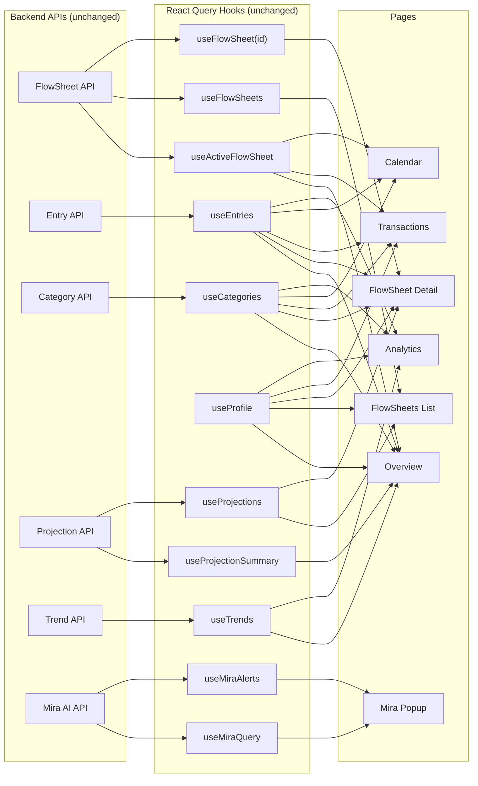

# Design Document: Overview Screen Redesign

## Overview

This design covers a comprehensive visual overhaul of Lunero's primary screens, replacing the current sidebar-based layout with a horizontal top tab bar and introducing a card-based, Figma-faithful design system across seven areas: Overview (formerly Dashboard), Tutorial Overlay, FlowSheets List & Detail, Transaction Calendar, Transactions Page, Analytics (formerly Trends), and Mira Floating Popup Chat.

The redesign preserves all existing data hooks (`useActiveFlowSheet`, `useEntries`, `useCategories`, `useProfile`, `useProjectionSummary`, `useTrends`, `useMiraQuery`, etc.), Zustand stores (`useEntryStore`, `useTutorialStore`), and backend API integrations. No backend changes are required. The work is purely frontend: new/updated Tamagui components in `packages/ui`, updated page components in `apps/web/app/(app)/`, and layout changes in `apps/web/components/nav/`.

### Key Design Decisions

1. **Sidebar → Top Tab Bar**: The vertical `Sidebar` component is removed entirely. A new `TopTabBar` component renders horizontally below a header area containing the Lunero logo and "Smart Budget Management" tagline. This frees horizontal space for wider content areas (calendar, charts, card grids).

2. **Component-first approach**: All new visual elements (SummaryCard, ActiveFlowSheetCard, MonthlyOverviewChart, RecentTransactionsList, FlowSheetCard, CategoryCard, SpendingByCategoryChart, MiraPopup, MiraFAB) are built as shared Tamagui components in `packages/ui/src/` so they can be reused in Phase 2 mobile.

3. **Charting library**: Use `recharts` (lightweight, React-native-friendly API, SSR-compatible) for the Monthly Overview bar chart and Spending by Category donut chart. Recharts integrates cleanly with Next.js and supports accessible `aria-label` on SVG elements.

4. **Mira as floating popup**: The `/mira` route is removed. The existing `AICoachPanel` is wrapped in a new `MiraPopup` component rendered at the app layout level, toggled by a `MiraFAB` button. Chat state is held in the layout so it persists across page navigations within a session.

5. **Route changes**: `/trends` → `/analytics`, `/past` → `/flowsheets`, `/past/[id]` → `/flowsheets/[id]`. The root `/` route remains but is renamed from "Dashboard" to "Overview."

---

## Visual Design Specification

This section documents every visual detail from the Figma prototypes so that developers can implement pixel-perfect screens without referencing Figma files.

### Typography

| Role | Font Family | Size | Weight | Color | Letter Spacing |
|------|-------------|------|--------|-------|----------------|
| Page title | Inter / Plus Jakarta Sans | 20px | 500 | `#1C1917` (stone900) | default |
| Section heading | Inter / Plus Jakarta Sans | 15–17px | 500 | `#1C1917` (stone900) | default |
| Body text | Inter / Plus Jakarta Sans | 14px | 400 | `#44403C` (stone700) | default |
| Labels / badges | Inter / Plus Jakarta Sans | 11–13px | 500 | varies | 0.5–1.5px |
| Muted text | Inter / Plus Jakarta Sans | 12–13px | 400 | `#A8A29E` (stone400) | default |
| Balance amount (large) | Inter / Plus Jakarta Sans | 32–36px | 300 | `#1C1917` (stone900) | default |
| Card amounts | Inter / Plus Jakarta Sans | 20–24px | 300 | `#1C1917` (stone900) | default |
| Uppercase labels | Inter / Plus Jakarta Sans | 11–12px | 500 | `#A8A29E` (stone400) | 1–1.5px |

### Color Palette

#### Neutrals (Stone scale)
| Token | Hex | Usage |
|-------|-----|-------|
| stone50 | `#FAFAF9` | Page background, primary button text, card panel bg |
| stone100 | `#F5F5F4` | Hover backgrounds, archived badge bg, secondary surfaces |
| stone200 | `#E7E5E4` | Card borders, dividers, progress bar empty track |
| stone300 | `#D6D3D1` | Secondary button borders, tutorial progress empty segments |
| stone400 | `#A8A29E` | Muted text, placeholder text, skip button text |
| stone500 | `#78716C` | Subtle text, archived badge text |
| stone700 | `#44403C` | Primary button bg, body text, tutorial progress filled, primary actions |
| stone800 | `#292524` | Primary button hover bg |
| stone900 | `#1C1917` | Page titles, headings, primary text |

#### Semantic Colors
| Token | Hex | Usage |
|-------|-----|-------|
| Income (Olive Gray) | `#6B6F69` | Income amounts, income progress bars, income chart bars, income dots |
| Expense (Clay Red) | `#C86D5A` | Expense amounts, expense progress bars, expense chart bars, expense dots, accent buttons, overspend indicators, tutorial checkmarks, "Active Period" badge, Mira send arrow |
| Savings (Warm Earth) | `#C4A484` | Savings amounts, savings chart bars, savings dots |
| Positive indicator | green (e.g. `#22C55E` or similar) | Positive balance badge, active FlowSheet badge, income calendar dots |
| Negative indicator | `#C86D5A` (Clay Red) | Negative balance badge, overspent amounts |
| Today highlight | blue/purple (e.g. `#6366F1`) | Calendar today circle background |
| White | `#FFFFFF` | Card backgrounds |

### Card Styling (Global)

All cards across every screen use these consistent values:

```
Background:       #FFFFFF
Border:           1px solid #E7E5E4
Border radius:    12px
Padding:          20–28px (24px typical)
Shadow (overlays): 0 8px 32px rgba(28, 25, 23, 0.18)
Shadow (modals):   0 20px 60px rgba(0, 0, 0, 0.15)
```

### Button Styling

| Variant | Background | Text Color | Border | Border Radius | Padding | Hover | Focus |
|---------|-----------|------------|--------|---------------|---------|-------|-------|
| Primary | `#44403C` | `#FAFAF9` | none | 8px | 8px 18px | bg → `#292524` | 2px solid `#44403C`, 2px offset |
| Accent | `#C86D5A` | `#FFFFFF` | none | 8px | 8px 18px | bg → `#b85e4c` | 2px solid `#C86D5A`, 2px offset |
| Secondary | transparent | `#44403C` | 1px solid `#D6D3D1` | 8px | 8px 18px | bg → `#F5F5F4` | 2px solid `#44403C`, 2px offset |

### Badge Styling

| Badge Type | Background | Text Color | Border Radius | Font Size | Weight | Text Transform |
|-----------|-----------|------------|---------------|-----------|--------|----------------|
| Active (green) | green bg (e.g. `#DCFCE7`) | green text (e.g. `#166534`) | 99px (pill) | 11px | 500 | uppercase |
| Active Period | `#C86D5A` | `#FFFFFF` | 99px (pill) | 11px | 500 | uppercase |
| Archived | `#F5F5F4` | `#78716C` | 99px (pill) | 11px | 500 | uppercase |
| Category badge | transparent or light bg | color matching entry type | 99px (pill) | 11–12px | 500 | none |
| Positive balance | green bg | green text | 99px (pill) | 11px | 500 | none |
| Negative balance | `#FDF2F0` | `#C86D5A` | 99px (pill) | 11px | 500 | none |

### Progress Bar Styling

```
Height:           6px
Border radius:    9999px (full pill)
Background track: #E7E5E4 (stone200)
Income fill:      #6B6F69 (Olive Gray)
Expense fill:     #C86D5A (Clay Red)
At-budget fill:   #A8A29E (warmNeutral)
Over-budget fill: #C86D5A (Clay Red)
```

### Spacing System

| Context | Value |
|---------|-------|
| Tight grouping (within a card) | 8px |
| Related sections | 16px |
| Major page sections | 24–28px |
| Page-level gap (between cards/sections) | 32px |
| Card internal padding | 20–28px |

### Layout Patterns

| Pattern | Value |
|---------|-------|
| Content max-width | 720px (single-column pages), 860px (analytics 2-col) |
| Card grid (desktop) | 2-column, gap 16–20px |
| Card grid (mobile < 768px) | 1-column |
| Summary cards (desktop) | 3-column row |
| Summary cards (mobile < 768px) | stack vertically |
| Top Tab Bar | full-width, horizontal, below logo/tagline header |


---

## Screen-by-Screen Visual Specifications

### Overview Screen Layout

```
┌─────────────────────────────────────────────────────────────┐
│  🌙 lunero          Smart Budget Management        [Help]   │
├─────────────────────────────────────────────────────────────┤
│  Overview | FlowSheets | Transactions | Calendar | Analytics | + Add New │
├─────────────────────────────────────────────────────────────┤
│                                                             │
│  ┌─ Balance Section ──────────────────────────────────────┐ │
│  │  Current Balance                                       │ │
│  │  $4,250.00                          [Positive ●]       │ │
│  └────────────────────────────────────────────────────────┘ │
│                                                             │
│  ┌─ Income ──┐  ┌─ Expenses ─┐  ┌─ Savings ─────────────┐ │
│  │  ↑        │  │  ↓         │  │  ◎                     │ │
│  │  $6,500   │  │  $1,850    │  │  $400                  │ │
│  │           │  │            │  │  8.1% of Income        │ │
│  └───────────┘  └────────────┘  └────────────────────────┘ │
│                                                             │
│  ┌─ Active FlowSheet Card ────────────────────────────────┐ │
│  │  March 2026 Budget    [Active ●]         Monthly       │ │
│  │  Mar 1, 2026 – Mar 31, 2026                            │ │
│  │  Income   ████████░░░░  $4,200 / $6,500                │ │
│  │  Expenses ██████░░░░░░  $1,850 / $3,000                │ │
│  │  Projected Balance: $2,100.00                          │ │
│  │                                    View Details →      │ │
│  └────────────────────────────────────────────────────────┘ │
│                                                             │
│  ┌─ Monthly Overview ─────────────────────────────────────┐ │
│  │  ● Income  ● Expenses  ● Savings                      │ │
│  │  ▐▐▐  ▐▐▐  ▐▐▐  ▐▐▐  ▐▐▐  ▐▐▐                       │ │
│  │  Oct  Nov  Dec  Jan  Feb  Mar                          │ │
│  └────────────────────────────────────────────────────────┘ │
│                                                             │
│  ┌─ Recent Transactions ──────────────────────────────────┐ │
│  │  ● Grocery Store   [Food]    Mar 15   −$85.50         │ │
│  │  ● Salary          [Salary]  Mar 14   +$3,200.00      │ │
│  │  ● Electric Bill   [Bills]   Mar 13   −$120.00        │ │
│  │  ● Coffee Shop     [Food]    Mar 12   −$4.50          │ │
│  │  ● Freelance       [Income]  Mar 11   +$500.00        │ │
│  └────────────────────────────────────────────────────────┘ │
└─────────────────────────────────────────────────────────────┘
```

- Balance Section: white card, "Current Balance" label (12px uppercase `#A8A29E`), amount in 32–36px weight 300, positive/negative badge pill to the right
- Summary Cards: 3-column row, each card is white with 1px `#E7E5E4` border, 12px radius, 20px padding. Top-right corner has a small type icon (↑ for income, ↓ for expenses, ◎ for savings). Label 11px uppercase `#A8A29E`, amount 20–24px weight 300, savings subtitle 12px `#A8A29E`
- Active FlowSheet Card: white card, name 15px weight 500, green "Active" pill badge, "Monthly" label right-aligned muted text, date range 13px `#A8A29E`, progress bars per the global spec, projected balance 14px, "View Details →" link 13px `#44403C`
- Monthly Overview Chart: white card, heading "Monthly Overview" 15px weight 500, legend with colored dots, grouped bar chart (6 months), Y-axis currency labels, X-axis month abbreviations
- Recent Transactions: white card, heading "Recent Transactions" 15px weight 500, 5 most recent entries, each row: colored dot (8px circle), note/description 14px, category badge, date 12px muted, signed amount 14px weight 500 colored by type

### Tutorial Overlay Layout

```
┌─────────────────────────────────────────────────────────────┐
│                    (dark backdrop)                           │
│                                                             │
│     ┌─ Step Card ────────────────────────────────────┐      │
│     │  ████████░░░░░░░░░░░░░░░░░░░░░░░░░░░░  [×]    │      │
│     │                                                │      │
│     │              ✨                                │      │
│     │                                                │      │
│     │  Welcome to Lunero! 🌙                         │      │
│     │                                                │      │
│     │  Lunero is built around a simple idea...       │      │
│     │                                                │      │
│     │  ✓ Set projected income and expenses           │      │
│     │  ✓ Track actual spending automatically         │      │
│     │  ✓ Compare budget vs reality in real-time      │      │
│     │  ✓ View past FlowSheets for insights           │      │
│     │                                                │      │
│     │  Previous        2 of 6           [Next →]     │      │
│     └────────────────────────────────────────────────┘      │
│                                                             │
└─────────────────────────────────────────────────────────────┘
```

- Backdrop: `rgba(28, 25, 23, 0.55)`, z-index 9999
- Step Card: bg `#FAFAF9`, border-radius 16px, padding 36px, max-width 480px, shadow `0 8px 32px rgba(28, 25, 23, 0.18)`
- Segmented Progress Bar: 6 equal segments, filled segments `#44403C`, empty segments `#D6D3D1`, height ~4px, gap 4px between segments, border-radius 2px per segment
- Close button (×): top-right, 14px, color `#A8A29E`, hover `#44403C`
- Emoji icon: centered, ~32px, one per step (✨📊🤙📅💫🎉)
- Title: 22px weight 600 `#1C1917`, with emoji suffix
- Description: 15px weight 400 `#44403C`, line-height 1.6
- Checkmark bullets: "✓" prefix in Clay Red `#C86D5A`, text 14px `#44403C`
- Navigation row: "Previous" text link left (13px `#A8A29E` underline), step counter center ("X of 6" 13px `#A8A29E`), "Next →" / "Get Started 🚀" button right (primary button style)

### FlowSheets List Page Layout

```
┌─────────────────────────────────────────────────────────────┐
│  FlowSheets                              [+ New FlowSheet]  │
│  Manage your budget periods and track projected vs actual.  │
│                                                             │
│  ┌─ FlowSheet Card ──────┐  ┌─ FlowSheet Card ──────────┐ │
│  │  March 2026 Budget     │  │  February 2026 Budget      │ │
│  │  [Active ●]   Monthly  │  │                   Monthly  │ │
│  │  📅 Mar 1 – Mar 31     │  │  📅 Feb 1 – Feb 28         │ │
│  │  Income  ████░░░ $4.2k │  │  Income  ██████ $6.5k      │ │
│  │  Expense ███░░░░ $1.8k │  │  Expense █████░ $2.9k      │ │
│  │  Projected: $2,100     │  │  Projected: $1,200         │ │
│  │           View Details →│  │           View Details →   │ │
│  └────────────────────────┘  └────────────────────────────┘ │
└─────────────────────────────────────────────────────────────┘
```

- Page title: "FlowSheets" 20px weight 500 `#1C1917`
- Subtitle: 14px `#44403C`
- "+ New FlowSheet" button: accent style (bg `#C86D5A`, white text, 8px radius)
- 2-column grid, gap 16–20px, stacks to 1-column below 768px
- Active card: green "Active" badge, optional accent left border (3px `#C86D5A` or green)
- Archived cards: no badge, standard border
- Each card: white bg, 1px `#E7E5E4` border, 12px radius, 20–24px padding
- Card content: name 15px weight 500, period type 13px muted right-aligned, calendar icon + date range 13px `#A8A29E`, progress bars (income Olive Gray, expense Clay Red), projected balance 14px, "View Details →" 13px `#44403C`

### FlowSheet Detail Page Layout

```
┌─────────────────────────────────────────────────────────────┐
│  ← March 2026 Budget                    [Active Period]     │
│    Mar 1, 2026 – Mar 31, 2026                               │
│                                                             │
│  ┌─ Total Income ─┐ ┌─ Total Expenses ┐ ┌─ Net Balance ──┐ │
│  │  $4,200.00     │ │  $1,850.00      │ │  $2,350.00     │ │
│  │  Proj: $6,500  │ │  Proj: $3,000   │ │  Proj: $3,500  │ │
│  └────────────────┘ └─────────────────┘ └────────────────┘ │
│                                                             │
│  Income Sources                                             │
│  ┌─ Salary ──────────┐  ┌─ Freelance ────────────────────┐ │
│  │  Income Source     │  │  Income Source                 │ │
│  │  Projected: $5,000 │  │  Projected: $1,500             │ │
│  │  Actual: $3,200    │  │  Actual: $1,000                │ │
│  │  ████████░░░░░░░░  │  │  ██████████░░░░░░              │ │
│  │  −$1,800.00        │  │  −$500.00                      │ │
│  └────────────────────┘  └────────────────────────────────┘ │
│                                                             │
│  Expense Categories                                         │
│  ┌─ Housing ─────────┐  ┌─ Food ─────────────────────────┐ │
│  │  Expense Category  │  │  Expense Category              │ │
│  │  Projected: $1,500 │  │  Projected: $500               │ │
│  │  Actual: $1,500    │  │  Actual: $350                  │ │
│  │  ████████████████  │  │  ██████████░░░░░░              │ │
│  │  $0.00             │  │  −$150.00                      │ │
│  └────────────────────┘  └────────────────────────────────┘ │
└─────────────────────────────────────────────────────────────┘
```

- Back arrow (←) + title: 20px weight 500 `#1C1917`
- Date range: 13px `#A8A29E`
- "Active Period" badge: bg `#C86D5A`, white text, pill shape. "Archived" badge: bg `#F5F5F4`, `#78716C` text
- 3 Detail Summary Cards: white card, amount 20–24px weight 300, "Projected: [amount]" subtitle 12px `#A8A29E`
- Category Cards: 2-column grid, white card, category name 15px weight 500, subtitle "Income Source" / "Expense Category" 12px `#A8A29E`, projected 13px, actual 14px weight 500, progress bar, difference value (positive green, negative Clay Red for expenses, positive with "+" prefix for income)
- Edit icon (pencil) top-right on unlocked cards

### Transaction Calendar Page Layout

```
┌─────────────────────────────────────────────────────────────┐
│  📅 Transaction Calendar                                    │
│                                                             │
│  ┌─ Calendar Card ────────────────────────────────────────┐ │
│  │                          March 2026    [←]  [→]        │ │
│  │  Sun  Mon  Tue  Wed  Thu  Fri  Sat                     │ │
│  │  ───  ───  ───  ───  ───  ───  ───                     │ │
│  │   1    2    3    4    5    6    7                       │ │
│  │        ●         ●●                                    │ │
│  │   8    9   10   11   12  [13]  14                      │ │
│  │   ●              ●        ◉●                           │ │
│  │  15   16   17   18   19   20   21                      │ │
│  │  ●●        ●                                           │ │
│  │  22   23   24   25   26   27   28                      │ │
│  │             ●                                          │ │
│  │  29   30   31                                          │ │
│  └────────────────────────────────────────────────────────┘ │
└─────────────────────────────────────────────────────────────┘
```

- Page title: "📅 Transaction Calendar" 20px weight 500
- Calendar card: full content width, white bg, 1px `#E7E5E4` border, 12px radius, 20px padding
- Day-of-week headers: 12px weight 500 `#78716C` uppercase
- Date numbers: 14px `#1C1917`
- Transaction dots: 6px circles below date numbers. Green = income, Red/coral (`#C86D5A`) = expense
- Today highlight: blue/purple circle background (e.g. `#6366F1` with white text)
- Month nav: arrows right of month/year label, secondary button style (border `#D6D3D1`)
- Out-of-period days: muted opacity

### Transactions Page Layout

```
┌─────────────────────────────────────────────────────────────┐
│  All Transactions                          8 transactions   │
│                                                             │
│  ┌─────────────────────────────────────────────────────────┐│
│  │ ● Grocery Store    [Food]     Mar 15    −$85.50    🗑  ││
│  │ ● Salary           [Salary]   Mar 14    +$3,200    🗑  ││
│  │ ● Electric Bill    [Bills]    Mar 13    −$120.00   🗑  ││
│  │ ● Coffee Shop      [Food]    Mar 12    −$4.50     🗑  ││
│  │ ● Freelance Work   [Income]  Mar 11    +$500.00   🗑  ││
│  │ ● Savings Transfer [Savings] Mar 10    −$400.00   🗑  ││
│  │ ● Rent             [Housing] Mar 1     −$1,200    🗑  ││
│  │ ● Side Project     [Income]  Mar 1     +$300.00   🗑  ││
│  └─────────────────────────────────────────────────────────┘│
└─────────────────────────────────────────────────────────────┘
```

- Page title: "All Transactions" 20px weight 500 `#1C1917`
- Transaction count: right-aligned, 14px `#A8A29E`
- Full-width list, each row separated by 1px `#E7E5E4` border-bottom
- Colored circle: 10px, left side. Green = income, Clay Red = expense, Warm Earth = savings
- Transaction name: 14px weight 400 `#1C1917`
- Category badge: pill, 11–12px, colored by entry type
- Date: 12px `#A8A29E`, formatted "MMM D, YYYY"
- Amount: 14px weight 500, "+" prefix green for income, "−" prefix Clay Red for expense
- Delete icon (trash): far right, 14px `#A8A29E`, hover `#C86D5A`

### Analytics Page Layout

```
┌─────────────────────────────────────────────────────────────┐
│  Analytics                                                  │
│                                                             │
│  ┌─ Spending by Category ──┐  ┌─ Monthly Overview ────────┐│
│  │                         │  │                            ││
│  │      ┌───────┐          │  │  ● Income ● Exp ● Savings ││
│  │     /  67%    \         │  │  ▐▐▐ ▐▐▐ ▐▐▐ ▐▐▐ ▐▐▐ ▐▐▐ ││
│  │    | Housing   |        │  │  Oct Nov Dec Jan Feb Mar   ││
│  │     \  16%    /         │  │                            ││
│  │      └───────┘          │  │                            ││
│  │  ■ Housing 67%          │  │                            ││
│  │  ■ Food 16%             │  │                            ││
│  │  ■ Transport 10%        │  │                            ││
│  │  ■ Other 7%             │  │                            ││
│  └─────────────────────────┘  └────────────────────────────┘│
└─────────────────────────────────────────────────────────────┘
```

- Page title: "Analytics" 20px weight 500 `#1C1917`
- 2-column layout, max-width 860px
- Left: "Spending by Category" card, white bg, donut/pie chart with percentage labels, legend below with colored squares + category name + percentage
- Right: "Monthly Overview" card, same grouped bar chart as Overview screen
- Stacks to 1-column below 768px (pie chart above bar chart)

### Mira Floating Popup Layout

```
                                    ┌─ Mira Popup ──────────┐
                                    │  Mira ✨    [−] [×]    │
                                    │  AI Budgeting Coach    │
                                    │ ───────────────────── │
                                    │                        │
                                    │  🤖 Hi! I'm Mira...   │
                                    │                        │
                                    │         How's my       │
                                    │         spending? ▸    │
                                    │                        │
                                    │ ───────────────────── │
                                    │  [Ask Mira anything..] │
                                    │  [How's my spending?]  │
                                    │  [Show savings]        │
                                    │  [Give me a tip]       │
                                    └────────────────────────┘
                                                        [?] ← FAB
```

- FAB: bottom-right, 56px circle, bg `#44403C`, "?" icon white, shadow `0 4px 12px rgba(0,0,0,0.15)`, aria-label "Open Mira AI coach"
- Popup: bottom-right corner, width 360px, max-height 520px, white bg, 12px radius, shadow `0 8px 32px rgba(28, 25, 23, 0.18)`
- Header: "Mira ✨" 16px weight 500 `#1C1917`, "AI Budgeting Coach" 12px `#A8A29E`, minimize (−) and close (×) buttons 14px `#78716C`
- Chat area: flex-grow, scrollable, message bubbles (user: right-aligned dark bg `#44403C` white text, Mira: left-aligned `#F5F5F4` dark text)
- Welcome message: shown when no messages exist
- Input: "Ask Mira anything..." placeholder, 14px, border `#E7E5E4`, 8px radius
- Send button: arrow icon, Clay Red `#C86D5A`
- Suggestion chips: below input, pill buttons, border `#E7E5E4`, 12px text, hover `#F5F5F4`


---

## Architecture

The redesign is a frontend-only change within the existing monorepo. No backend modifications are needed.

```mermaid
graph TD
    subgraph "apps/web"
        Layout["App Layout<br/>(app)/(app)/layout.tsx"]
        TopTabBar["TopTabBar Component"]
        MiraFAB["MiraFAB + MiraPopup"]
        
        Overview["Overview Page<br/>/ (root)"]
        FlowSheetsList["FlowSheets List<br/>/flowsheets"]
        FlowSheetDetail["FlowSheet Detail<br/>/flowsheets/[id]"]
        Transactions["Transactions Page<br/>/transactions"]
        Calendar["Calendar Page<br/>/calendar"]
        Analytics["Analytics Page<br/>/analytics"]
    end

    subgraph "packages/ui"
        SummaryCard["SummaryCard"]
        ActiveFSCard["ActiveFlowSheetCard"]
        MonthlyChart["MonthlyOverviewChart"]
        RecentTxList["RecentTransactionsList"]
        FSCard["FlowSheetCard (redesigned)"]
        CategoryCard["CategoryCard"]
        SpendingChart["SpendingByCategoryChart"]
        TutorialOverlay["TutorialOverlay (redesigned)"]
        MiraPopupComp["MiraPopup"]
        MiraFABComp["MiraFAB"]
        TransactionRow["TransactionRow"]
    end

    subgraph "packages/api-client + core"
        Hooks["Existing Hooks<br/>useActiveFlowSheet, useEntries,<br/>useCategories, useProfile,<br/>useProjectionSummary, useTrends,<br/>useMiraQuery, useMiraAlerts"]
        Types["Core Types<br/>FlowSheet, Entry, Category,<br/>ProjectionSummary, TrendData"]
    end

    Layout --> TopTabBar
    Layout --> MiraFAB
    Layout --> Overview
    Layout --> FlowSheetsList
    Layout --> FlowSheetDetail
    Layout --> Transactions
    Layout --> Calendar
    Layout --> Analytics

    Overview --> SummaryCard
    Overview --> ActiveFSCard
    Overview --> MonthlyChart
    Overview --> RecentTxList
    FlowSheetsList --> FSCard
    FlowSheetDetail --> CategoryCard
    Analytics --> SpendingChart
    Analytics --> MonthlyChart
    Transactions --> TransactionRow

    Overview --> Hooks
    FlowSheetsList --> Hooks
    FlowSheetDetail --> Hooks
    Transactions --> Hooks
    Calendar --> Hooks
    Analytics --> Hooks
    MiraFAB --> Hooks
```



### File Structure Changes

```
apps/web/
├── app/(app)/
│   ├── layout.tsx                    # MODIFIED: Remove Sidebar, add TopTabBar + MiraFAB/MiraPopup
│   ├── page.tsx                      # MODIFIED: Redesigned as Overview screen
│   ├── flowsheets/                   # NEW: Replaces /past
│   │   ├── page.tsx                  # NEW: FlowSheets list page
│   │   └── [id]/
│   │       └── page.tsx              # NEW: FlowSheet detail page (redesigned)
│   ├── transactions/
│   │   └── page.tsx                  # NEW: All Transactions page
│   ├── calendar/
│   │   └── page.tsx                  # MODIFIED: Redesigned as Transaction Calendar
│   ├── analytics/                    # NEW: Replaces /trends
│   │   └── page.tsx                  # NEW: Analytics page (redesigned)
│   ├── past/                         # REMOVED (redirects to /flowsheets)
│   ├── trends/                       # REMOVED (redirects to /analytics)
│   └── mira/                         # REMOVED (replaced by MiraPopup)
├── components/nav/
│   ├── sidebar.tsx                   # REMOVED
│   └── topbar.tsx                    # REMOVED (replaced by TopTabBar in layout)

packages/ui/src/
├── top-tab-bar.tsx                   # NEW
├── summary-card.tsx                  # NEW
├── active-flow-sheet-card.tsx        # NEW
├── monthly-overview-chart.tsx        # NEW
├── recent-transactions-list.tsx      # NEW
├── category-card.tsx                 # NEW
├── spending-by-category-chart.tsx    # NEW
├── transaction-row.tsx               # NEW (redesigned from entry-row)
├── mira-popup.tsx                    # NEW
├── mira-fab.tsx                      # NEW
├── tutorial-overlay.tsx              # MODIFIED: Segmented progress bar, emoji, bullets
├── flow-sheet-card.tsx               # MODIFIED: Add progress bars, projected balance
├── balance-display.tsx               # MODIFIED: Add positive/negative badge
```

---

## Components and Interfaces

### TopTabBar

```typescript
// packages/ui/src/top-tab-bar.tsx
export interface TopTabBarProps {
  /** Currently active route path */
  activePath: string;
  /** Called when a tab is activated */
  onNavigate: (path: string) => void;
  /** Called when "+ Add New" is activated */
  onAddNew: () => void;
}

export interface TabItem {
  path: string;
  label: string;
}

// Tabs: Overview (/), FlowSheets (/flowsheets), Transactions (/transactions),
//        Calendar (/calendar), Analytics (/analytics)
// Plus: "+ Add New" action button (accent style)
// Header area: Lunero logo left, "Help" link right
```

### SummaryCard

```typescript
// packages/ui/src/summary-card.tsx
export interface SummaryCardProps {
  label: 'Income' | 'Expenses' | 'Savings';
  amount: number;
  currency: string;
  /** Optional subtitle, e.g. "8.1% of Income" for savings */
  subtitle?: string;
  /** Icon indicator: ↑ income, ↓ expenses, ◎ savings */
  icon: '↑' | '↓' | '◎';
}
```

### ActiveFlowSheetCard

```typescript
// packages/ui/src/active-flow-sheet-card.tsx
export interface ActiveFlowSheetCardProps {
  name: string;
  periodType: string;
  startDate: string;
  endDate: string;
  incomeActual: number;
  incomeProjected: number;
  expenseActual: number;
  expenseProjected: number;
  projectedBalance: number;
  currency: string;
  onViewDetails: () => void;
}
```

### MonthlyOverviewChart

```typescript
// packages/ui/src/monthly-overview-chart.tsx
import type { TrendPeriod } from './trend-chart';

export interface MonthlyOverviewChartProps {
  /** Rolling 6-month data from useTrends hook */
  periods: TrendPeriod[];
  currency: string;
}
// Uses recharts BarChart with grouped bars for Income, Expenses, Savings
// Colors: Income #6B6F69, Expenses #C86D5A, Savings #C4A484
// Legend with colored dots, Y-axis currency, X-axis month abbreviations
// Wrapped in white card with "Monthly Overview" heading
```

### RecentTransactionsList

```typescript
// packages/ui/src/recent-transactions-list.tsx
import type { Entry, Category } from '@lunero/core';

export interface RecentTransactionsListProps {
  /** 5 most recent entries, pre-sorted by entryDate desc */
  entries: Entry[];
  categories: Category[];
  currency: string;
}
// Each item: colored dot, note/description, category badge, date, signed amount
// Empty state: "No transactions yet."
```

### FlowSheetCard (Redesigned)

```typescript
// packages/ui/src/flow-sheet-card.tsx (modified)
export interface FlowSheetCardProps {
  flowSheet: FlowSheet;
  currency: string;
  /** Projection data for income/expense progress bars */
  projections?: {
    incomeProjected: number;
    incomeActual: number;
    expenseProjected: number;
    expenseActual: number;
    projectedBalance: number;
  };
  onViewDetails: (id: string) => void;
}
// Displays: name, Active badge (if active), period type, date range,
// income/expense progress bars, projected balance, "View Details →"
```

### CategoryCard

```typescript
// packages/ui/src/category-card.tsx
export interface CategoryCardProps {
  categoryName: string;
  categoryType: 'Income Source' | 'Expense Category';
  projectedAmount: number;
  actualAmount: number;
  currency: string;
  /** Whether the FlowSheet is unlocked for editing */
  isEditable?: boolean;
  onEdit?: () => void;
}
// Displays: name, type subtitle, projected amount, actual amount with progress bar,
// difference (positive green for income surplus, Clay Red for expense overspend)
// Edit pencil icon top-right when isEditable
```

### SpendingByCategoryChart

```typescript
// packages/ui/src/spending-by-category-chart.tsx
export interface CategoryExpenseData {
  categoryId: string;
  categoryName: string;
  amount: number;
  percentage: number;
  color: string;
}

export interface SpendingByCategoryChartProps {
  data: CategoryExpenseData[];
  currency: string;
}
// Uses recharts PieChart (donut variant) with percentage labels
// Legend below: colored squares + category name + percentage
// Empty state: "No expense data yet."
```

### TransactionRow

```typescript
// packages/ui/src/transaction-row.tsx
import type { EntryType } from '@lunero/core';

export interface TransactionRowProps {
  id: string;
  entryType: EntryType;
  note?: string;
  categoryName: string;
  entryDate: string;
  amount: number;
  currency: string;
  onDelete: (id: string) => void;
}
// Colored circle left, note/description, category badge, date, signed amount, delete icon right
```

### MiraPopup

```typescript
// packages/ui/src/mira-popup.tsx
import type { ChatMessage, MiraAlertItem } from './ai-coach-panel';

export interface MiraPopupProps {
  isOpen: boolean;
  messages: ChatMessage[];
  alerts: MiraAlertItem[];
  isQuerying: boolean;
  isLoadingAlerts: boolean;
  isDismissingId?: string;
  unavailable?: boolean;
  onSubmitQuery: (message: string) => void;
  onDismissAlert: (id: string) => void;
  onMinimize: () => void;
  onClose: () => void;
}
// Suggestion chips: "How's my spending?", "Show savings", "Give me a tip"
// Welcome message when no messages exist
```

### MiraFAB

```typescript
// packages/ui/src/mira-fab.tsx
export interface MiraFABProps {
  onClick: () => void;
  /** Whether the popup is currently open (hides FAB when true) */
  isPopupOpen: boolean;
}
// 56px circle, bottom-right fixed position, "?" icon, aria-label "Open Mira AI coach"
```

### TutorialOverlay (Redesigned)

```typescript
// packages/ui/src/tutorial-overlay.tsx (modified)
export interface TutorialOverlayProps {
  isOpen: boolean;
  onComplete: () => void;
  onSkip: () => void;
}
// Changes from current implementation:
// - Replace dot progress with Segmented_Progress_Bar (6 segments)
// - Add emoji icons per step (✨📊🤙📅💫🎉)
// - Update titles with emoji suffixes
// - Restructure content into description + checkmark bullet lists
// - Add Close (×) button top-right
// - Update nav: "Previous" text link left, "X of 6" center, "Next →" / "Get Started 🚀" right
// - Preserve existing keyboard nav (Escape, arrows) and auto-launch behavior
```


---

## Data Models

No new data models are introduced. The redesign consumes existing types from `@lunero/core`:

### Existing Types Used

```typescript
// From packages/core/src/types.ts
interface FlowSheet {
  id: string;
  userId: string;
  periodType: 'weekly' | 'monthly' | 'custom';
  startDate: string;
  endDate: string;
  status: 'active' | 'archived';
  editLocked: boolean;
  availableBalance: number;
  totalIncome: number;
  totalExpenses: number;
  totalSavings: number;
  createdAt: string;
  updatedAt: string;
}

interface Entry {
  id: string;
  flowSheetId: string;
  userId: string;
  entryType: 'income' | 'expense' | 'savings';
  categoryId: string;
  amount: number;
  currency: string;
  convertedAmount?: number;
  entryDate: string;
  note?: string;
  isDeleted: boolean;
  createdAt: string;
  updatedAt: string;
}

interface Category {
  id: string;
  userId: string;
  name: string;
  entryType: 'income' | 'expense' | 'savings';
  isDefault: boolean;
  sortOrder: number;
}

interface ProjectionSummary {
  flowSheetId: string;
  byCategory: Array<{
    categoryId: string;
    categoryName: string;
    entryType: 'income' | 'expense' | 'savings';
    projectedAmount: number;
    actualAmount: number;
    statusColor: string;
  }>;
  byEntryType: Record<'income' | 'expense' | 'savings', {
    projected: number;
    actual: number;
    statusColor: string;
  }>;
  overall: { projected: number; actual: number; statusColor: string };
}

interface TrendData {
  view: 'weekly' | 'monthly' | 'yearly';
  periods: TrendPeriod[];
}

interface TrendPeriod {
  id: string;
  label: string;
  startDate: string;
  endDate: string;
  totalIncome: number;
  totalExpenses: number;
  totalSavings: number;
  availableBalance: number;
}
```

### Derived View Models (computed client-side)

```typescript
/** Used by SpendingByCategoryChart — derived from entries + categories */
interface CategoryExpenseData {
  categoryId: string;
  categoryName: string;
  amount: number;        // sum of expenses in this category
  percentage: number;    // (amount / totalExpenses) * 100
  color: string;         // assigned from a palette
}

/** Used by SummaryCard — derived from FlowSheet totals */
interface SummaryCardData {
  label: 'Income' | 'Expenses' | 'Savings';
  amount: number;
  subtitle?: string;     // e.g. "8.1% of Income" for savings
}

/** Mira popup state — managed in app layout */
interface MiraPopupState {
  isOpen: boolean;
  isMinimized: boolean;
  messages: ChatMessage[];
}
```

### Data Flow



